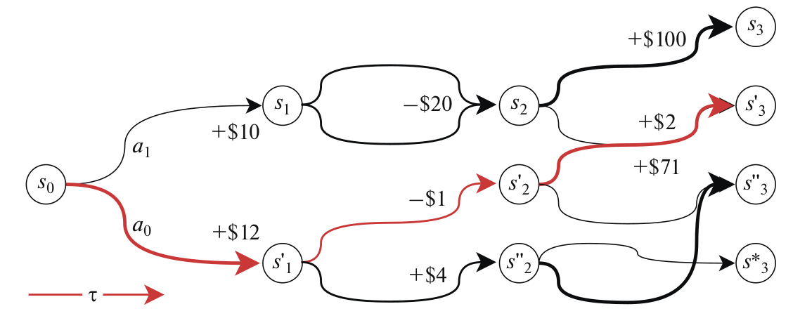
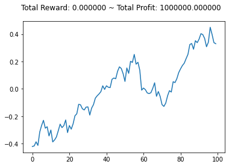
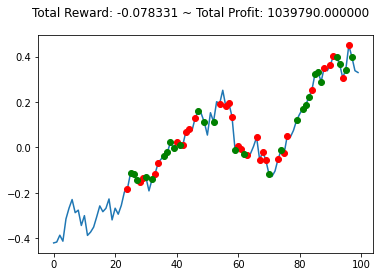

# gym-anytrading 2.0

`gym-anytrading 2.0` is a fork of `gym-anytrading`, a collection of [OpenAI Gym](https://github.com/openai/gym) environments for reinforcement learning-based trading algorithms,
with **TODO**


Trading algorithms, for the time being, are mostly implemented in one market: [Future](https://en.wikipedia.org/wiki/Futures_contract).

TradingEnv is an abstract environment which is defined to support all kinds of trading environments. 
FutureEnv is simply an extension of TradingEnv, made to mimic a future market.


## Installation

### From Repository
```bash
git clone https://github.com/paolodelia99/gym-anytrading-2.0
cd gym-anytrading
pip install -e .
```

## Differences and peculiarities from gym-anytrading



The two main differences from the original projects are in the way the rewards are calculated and in the possible actions.
First, a **hold** action is added to the all to the agent's arsenal of possible actions. Consequently, 
also a **NoPosition** is being added to the possible position state. 
Differently from the idea of many papers, in the `gym-anytrading-2.0` the step rewards are calculated in the following way: 
let `cp` the price of the traded asset at the current step `i`, and let `ltp` the last traded price that is the price we the 
agent has opened a trade. If the agent position is a long position the current step reward is given by the log-returns 
that the agent could get by closing the trade: 

%20)

similarly, if the agent position is a short position the current step reward is 

)

Furthermore, FutureEnv does implement a simple money management rule: the **Fixed fractional 
position sizing**, also known as **fixed risk** position sizing because it risks the same 
percentage or fraction of account equity on each trade. For example, you might risk 2% of 
your account equity on each trade (the "2% rule").

The input data given to the `FuturesEnv` class is scaled using a `MinMaxScaler`, so you don't have to worry about the data 
scaling before. 

## Trading Environments

### TradingEnv
TradingEnv is an abstract class which inherits `gym.Env`. This class aims to provide a 
general-purpose environment for all kinds of trading markets. Here I explain its public
properties and methods. But feel free to take a look at the
complete [source code](https://github.com/paolodelia99/gym-anytrading-2.0/blob/master/gym_anytrading/envs/trading_env.py).

* Properties:
> `df`: An abbreviation for **DataFrame**. It's a **pandas'** DataFrame which contains your dataset and is passed in the class' constructor.
>
> `prices`: Real prices over time. Used to calculate profit and render the environment.
>
> `signal_features`: Extracted features over time. Used to create *Gym observations*.
>
> `window_size`: Number of ticks (current and previous ticks) returned as a *Gym observation*. It is passed in the class' constructor.
>
> `action_space`: The *Gym action_space* property. Containing discrete values of **0=Sell** and **1=Buy**.
>
> `observation_space`: The *Gym observation_space* property. Each observation is a window on `signal_features` from index **current_tick - window_size + 1** to **current_tick**. So `_start_tick` of the environment would be equal to `window_size`. In addition, initial value for `_last_trade_tick` is **window_size - 1** .
>
> `shape`: Shape of a single observation.
>
> `history`: Stores the information of all steps.

* Methods:
> `seed`: Typical *Gym seed* method.
>
> `reset`: Typical *Gym reset* method.
>
> `step`: Typical *Gym step* method.
>
> `render`: Typical *Gym render* method. Renders the information of the environment's current tick.
>
> `render_all`: Renders the whole environment.
>
> `close`: Typical *Gym close* method.

* Abstract Methods:
> `_process_data`: It is called in the constructor and returns `prices` and `signal_features` as a tuple. In different trading markets, different features need to be obtained. So this method enables our TradingEnv to be a general-purpose environment and specific features can be returned for specific environments such as *FOREX*, *Stocks*, etc.
>
> `_calculate_reward`: The reward function for the RL agent.
>
> `_update_profit`: Calculates and updates total profit which the RL agent has achieved so far. Profit indicates the amount of units of currency you have achieved by starting with *1.0* unit (Profit = FinalMoney / StartingMoney).
>
> `max_possible_profit`: The maximum possible profit that an RL agent can obtain regardless of trade fees.

### FutureEnv
This is a concrete class which inherits TradingEnv and implements its abstract methods. 
Also, it has some specific properties for the *Future* market.
For more information refer to the [source code](https://github.com/paolodelia99/gym-anytrading-2.0/blob/master/gym_anytrading/envs/future_env.py).

* Properties:
> `frame_bound`: A tuple which specifies the start and end of `df`. It is passed in the class' constructor.
>
> `pos_size`: Specifies the percentage of the total capital used in each trade (default 5%).
>
> `risk_per_contract`: 
> 
> `point_value`: says what the currency amount is for a 1-point price change in an instrument.
> 
> `inital_capital`: the initial capital of the agent (default 1000000)


Besides, you can create your own customized environment by extending TradingEnv or even ForexEnv or StocksEnv with your desired policies for calculating reward, profit, fee, etc.

## Examples


### Create an environment

```python
import pandas as pd
from gym_anytrading2.envs import FuturesEnv

cl_df = pd.read_csv(dataset_path, index_col=0)
window_size = 21

env = FuturesEnv(df=cl_df,
                 window_size=window_size,
                 frame_bound=(window_size, len(cl_df)))

```

> This will create the default environment. You can change any parameters such as dataset, frame_bound, etc.


### Print some information


```python
print("env information:")
print("> shape:", env.shape)
print("> df.shape:", env.df.shape)
print("> prices.shape:", env.prices.shape)
print("> signal_features.shape:", env.signal_features.shape)
```

    env information:
    > shape: (24, 2)
    > df.shape: (6225, 5)
    > prices.shape: (6225,)
    > signal_features.shape: (6225, 2)

### Plot the environment


```python
env.reset()
env.render()
```





- **Short** and **Long** trade are shown in `red` and `green` colors.
- As you see, the starting *position* of the environment is always **NoPosition**.

### A complete example

```python
import pandas as pd
from gym_anytrading2.envs import FuturesEnv
import matplotlib.pyplot as plt

dataset_path = './data/_path_to_dataset.csv'

cl_df = pd.read_csv(dataset_path, index_col=0)
window_size = 21

env = FuturesEnv(df=cl_df,
                 window_size=window_size,
                 frame_bound=(window_size, 121))

observation = env.reset()
while True:
  action = env.action_space.sample()
  observation, reward, done, info = env.step(action)
  
  if done:
    print("info:", info)
    break

plt.cla()
env.render_all()
plt.show()
```

    info: {'total_reward': -173.10000000000602, 'total_profit': 0.980652456904312, 'position': 0}
    





- You can use `render_all` method to avoid rendering on each step and prevent time-wasting.
- As you see, the first **10** points (`window_size`=10) on the plot don't have a *position*. Because they aren't involved in calculating reward, profit, etc. They just display the first observations. So the environment's `_start_tick` and initial `_last_trade_tick` are **10** and **9**.

## Notebooks

- with stable baseline and quantstats
  - [A2C](https://github.com/paolodelia99/gym-anytrading-2.0/blob/master/gym_anytrading/examples/a2c_cl_stablebaseline.ipynb)
  - [DQN](https://github.com/paolodelia99/gym-anytrading-2.0/blob/master/gym_anytrading/examples/dqn_cl_stablebaseline.ipynb)
- with the `agent` class
  - [DQN daily data](https://github.com/paolodelia99/gym-anytrading-2.0/blob/master/gym_anytrading/examples/ddqn_cl_d.ipynb)
  - [DQN hourly data](https://github.com/paolodelia99/gym-anytrading-2.0/blob/master/gym_anytrading/examples/ddqn_cl_h.ipynb)


### Extend and manipulate TradingEnv

In case you want to process data and extract features outside the environment, it can be simply done by two methods:

**Method 1 (Recommended):**


```python
def my_process_data(env):
    start = env.frame_bound[0] - env.window_size
    end = env.frame_bound[1]
    prices = env.df.loc[:, 'Low'].to_numpy()[start:end]
    signal_features = env.df.loc[:, ['Close', 'Open', 'High', 'Low']].to_numpy()[start:end]
    return prices, signal_features


class MyForexEnv(ForexEnv):
    _process_data = my_process_data


env = MyForexEnv(df=FOREX_EURUSD_1H_ASK, window_size=12, frame_bound=(12, len(FOREX_EURUSD_1H_ASK)))
```

**Method 2:**


```python
def my_process_data(df, window_size, frame_bound):
    start = frame_bound[0] - window_size
    end = frame_bound[1]
    prices = df.loc[:, 'Low'].to_numpy()[start:end]
    signal_features = df.loc[:, ['Close', 'Open', 'High', 'Low']].to_numpy()[start:end]
    return prices, signal_features


class MyStocksEnv(StocksEnv):
    
    def __init__(self, prices, signal_features, **kwargs):
        self._prices = prices
        self._signal_features = signal_features
        super().__init__(**kwargs)

    def _process_data(self):
        return self._prices, self._signal_features

    
prices, signal_features = my_process_data(df=STOCKS_GOOGL, window_size=30, frame_bound=(30, len(STOCKS_GOOGL)))
env = MyStocksEnv(prices, signal_features, df=STOCKS_GOOGL, window_size=30, frame_bound=(30, len(STOCKS_GOOGL)))
```


## Todos

- [ ] Add continuous action
- [x] Improve render environment
- [x] clean the Future env class code (working on it)
- [ ] Add commissions
- [ ] Add test
  - [x] Basic tests
  - [ ] Add further tests about the `step()` method
- [ ] change the reward function [Financial Market as a Game] 